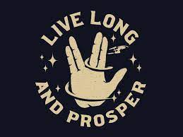

# My Portfolio Website

**Description:** This repo contains my portfolio website being developed as part of my course work deliverable. I thinking of expanding this over time to build my personal branding whichever path lies ahead. Live long and prosper 🖖🏾.

**Usage:** Download the code repository to your computer, load the `index.html` in your web browser. Currently using HTML, CSS and JavaScript to develop this webiste.

**Roadmap:** Move this to react and add fancy widgets along with cool demos of my future projects

